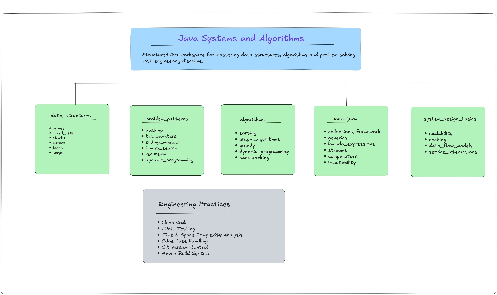

***

# Java Systems and Algorithms

> **Why this repo exists?**  
> I started this project during my 2-2 semester to bridge the gap between "solving LeetCode" and "engineering systems." Instead of just chasing green checkmarks on a platform, I'm focused on how these algorithms behave within the JVM. My goal is to master Java 21 features like **Virtual Threads** and **Pattern Matching** while keeping my implementations clean, documented, and production-ready.

This repository is a structured space for practicing **Data Structures and Algorithms** in Java while building strong backend-oriented coding habits.

The goal is not to collect solutions, but to write **clean, testable, and well-documented** implementations.

## What I'm Practicing Here

• Data structures and algorithm fundamentals  
• Writing clean Java implementations  
• Unit testing algorithmic code with JUnit  
• Edge case thinking and complexity analysis  
• Maintaining a structured codebase

## Project Structure

```
src/main/java/com/shravya/systems/
├── data_structures/
├── algorithms/
├── problem_patterns/
├── core_java/
└── system_design_basics/
```
## Repository Architecture

This repository is organized as a structured Java learning workspace.
It separates data structures, algorithm patterns, core Java concepts,
and system design fundamentals while emphasizing engineering practices.


### Folder Meaning
- **`data_structures`** – Implementation of core structures (arrays, trees, graphs, etc.)
- **`algorithms`** – Core procedures (searching, sorting, recursion, DP, etc.)
- **`problem_patterns`** – Reusable techniques (two-pointer, sliding window, DFS/BFS, etc.)
- **`core_java`** – Java-specific fundamentals (collections, memory model, etc.)
- **`system_design_basics`** – Foundational backend/system thinking

**Problems are placed based on their dominant concept.**

## Implementation Guidelines

Each class includes:
- Problem description
- Category (Data Structure / Algorithm / Pattern)
- Time complexity
- Space complexity
- Edge case considerations

**Unit tests** are written using **JUnit** under:

```
src/test/java/
```

## Build & Tools
- **Java 21** (LTS)
- **Maven** (dependency and build management)
- **JUnit** (testing)
- **Git** for version control

## Workflow
For every problem:
1. Implement logic cleanly
2. Document complexity
3. Write unit tests
4. Run tests
5. Commit with a meaningful message
6. Push to GitHub

***

